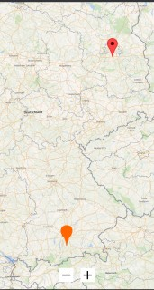

# Ti.OSM - OpenstreetMap module for Titanium (Android)

<br/>
Use OpenstreetMap as a map in Titanium. Library: <a href="https://github.com/osmdroid/osmdroid">osmdroid</a>

## Setup

Add module to `tiapp.xml`:

```xml
<module>ti.osm</module>
```

#### Classic version:
```javascript
const win = Titanium.UI.createWindow({});
const OSM = require('ti.osm');

const osmView = OSM.createOSMView({
	lifecycleContainer: win
});
osmView.addEventListener("regionchanged", function(e) {
	console.log(e.longitude, e.latitude);
})
osmView.addEventListener("zoom", function(e) {
	console.log(e.zoomLevel);
})

win.add(osmView);
win.open();
```

#### Alloy version:

view.xml
```xml
<OSMView module="ti.osm" id="osm"/>
```

## Properties

* set start location
```javascript
mapview.location = { longitude: 0.0, latitude: 0.0, zoomLevel: 5}
```

* allow map rotation
```javascript
mapview.allowRotation = true;
```

* set user location (creation only)
```javascript
OSM.createOSMView({
    userLocation: true,     // show marker
    followLocation: true    // automatically set viewport to userlocation
});
```

* mapType:
```javascript
OSM.createOSMView({
    mapType: OSM.WIKIMEDIA
});
```
    allowed constants:
    * MAPNIK
    * WIKIMEDIA
    * PUBLIC_TRANSPORT
    * CLOUDMADESTANDARDTILES
    * CLOUDMADESMALLTILES
    * FIETS_OVERLAY_NL
    * BASE_OVERLAY_NL
    * ROADS_OVERLAY_NL
    * HIKEBIKEMAP
    * OPEN_SEAMAP
    * USGS_TOPO
    * USGS_SAT


* change map type:
```javascript
mapView.mapType = OSM.PUBLIC_TRANSPORT;
```

* userAgent: by default the bundleId will be used. If you want to change it you can use the creation-only `userAgent` property
```javascript
OSM.createOSMView({
    userAgent: "customString"
});
```

* downloadAllowed: returns true/false if caching is allowed

## Methods

* clear all markers:
`clearMarker();`

* add a marker
```javascript
osmView.addMarker({
    longitude: 0.00,
    latitude: 0.00,
    title: "title",
    icon: "/path/to/image.png",  // marker icon
    image: "/path/to/image.png"  // image inside the infobox
});
```

* add multiple markers: if you want to add many markers you can use this syntax to increase performance:
```javascript
var markerList = []
for (var i = 0; i < 100; ++i) {
	markerList.push({
		longitude: 11.581981 + Math.random(),
		latitude: 48.135124 + Math.random(),
		icon: "/marker_default.png",
		title: "this is a longer text",
	});
}
osmView.addMarkers(markerList);
```

* pause/resume: if you manually need to call the pause/resume event (will be called automatically if you assign the livecycleContainer). Will pause the userlocation calls

* downloadAreaAsync(zoommin, zoommax)

* possibleTilesInArea(zoommin, zoommax)

* currentCacheUsage()

* cacheCapacity()


## Events

* **infoboxClick** return `marker`, `type`
* **markerClick** return `marker`, `type`
* **regionchanged** returns `longitude`, `latitude`
* **zoom** returns `zoomLevel`
* **downloadprogress**
* **downloadcomplete**
* **downloadfailed**
* **downloadstarted**

## Example
```javascript
var OSM = require('ti.osm');
var win = Titanium.UI.createWindow();
var osmView = OSM.createOSMView({
    userLocation: true,
	followLocation: false
});

osmView.location = {
	longitude: 151.276417,
	latitude: -33.891614,
	zoomLevel: 9.5
}

osmView.addMarker({
	longitude: 151.276417,
	latitude: -33.891614,
	icon: "/marker_default.png",
	title: "this is a longer text",
});

osmView.addMarker({
	longitude: 151.3,
	latitude: -33.88,
	title: "test 2",
	image: "/appicon.png"
});

osmView.addEventListener("infoboxClick", onClick);
osmView.addEventListener("markerClick", onClick);
osmView.allowRotation = true;

function onClick(e) {
	console.log("Marker:", e.marker);
	console.log("Type:", e.type);
}
win.add(osmView);
win.open();
```


## Authors

* Michael Gangolf (<a href="https://github.com/m1ga">@MichaelGangolf</a> / <a href="https://www.migaweb.de">Web</a>)

## Premium Sponsor
Initial development was sponsored by <a href="https://www.wikimedia.it/">Wikimedia Italia</a>. Thank you for the support and allowing the module to be available as an open-source module!
